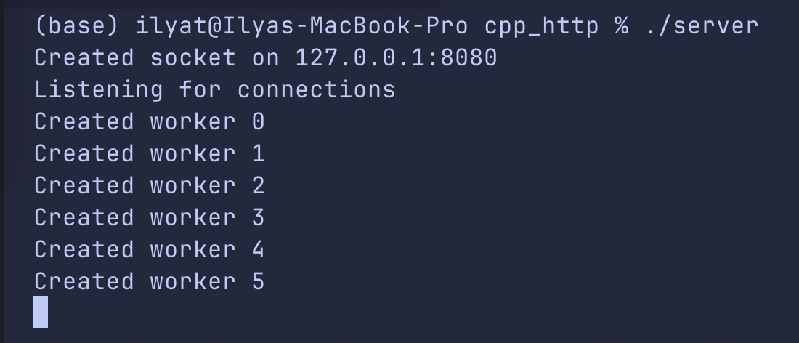
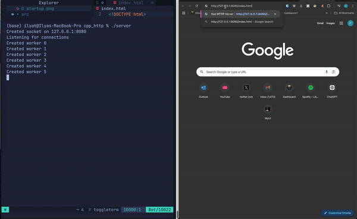
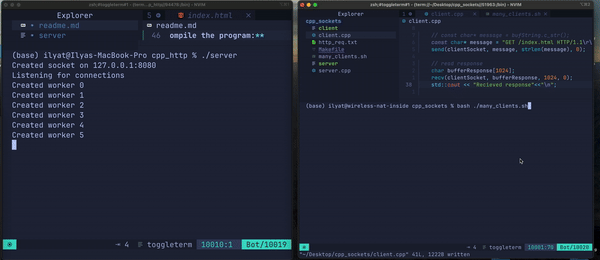

# Multithreaded HTTP Server in C++

This C++ project implements a simple multithreaded HTTP server using Boost Beast. The server listens for incoming HTTP connections, processes GET requests, and serves static files from a specified directory. The server efficiently handles multiple clients using a thread pool, ensuring better concurrency and performance.


***

## Features 🚀
* 📡 **File Serving**: Processes HTTP GET requests and serves static files from a `resources` directory.
* 🧵 **Multithreaded Handling**: Uses a thread pool (6 threads by default) for efficient request processing.
* 🧩 **Modular Codebase**: Clean and separated code for easy maintenance.
* ⚡ **High Performance**: Handles 500-1000 RPS (Requests Per Second).
* 🔓 **Safety Third**: Who needs firewalls? This server exposes your whole computer to the internet💀

***
## Demo Video

You can watch a demo of the project in action [here](https://www.youtube.com/watch?v=YOUR_DEMO_LINK).
[](https://www.youtube.com/watch?v=YOUR_DEMO_LINK)
***

## Design

The project is designed using Object-Oriented Programming (OOP) principles. It is divided into three main parts:

- `main.cpp`: Initializes the server, sets up signal handling for graceful shutdown, and starts listening for incoming connections.
- `http_server.h`: Declares the `TcpServer` class, which manages socket operations, worker threads, and request handling.
- `http_server.cpp`: Implements the `TcpServer` class, including socket creation, binding, listening, accepting client connections, parsing HTTP requests using Boost Beast, and responding to clients.

***
## How to Run

To compile and run the program, follow these steps:

1. **Clone the repo:**
    ```bash
    git clone https://github.com/yourusername/cpp-http-server.git
    ```
2. **Navigate to the project directory:**
    ```bash
    cd cpp-http-server
    ```
3. **Ensure Boost is installed on your system.** If not, install it using your package manager. For example, on Ubuntu:
    ```bash
    sudo apt-get install libboost-all-dev
    ```
4. **Compile the program:**
    ```bash
    make
    ```
5. **Run the server:**
    ```bash
    ./server
    ```
6. **Access the server:**
    Open your web browser and navigate to `http://127.0.0.1:8080`.

***
## Screenshots

**Server Startup**


**Handling a GET Request**



**Handling 1000 requests**


***
